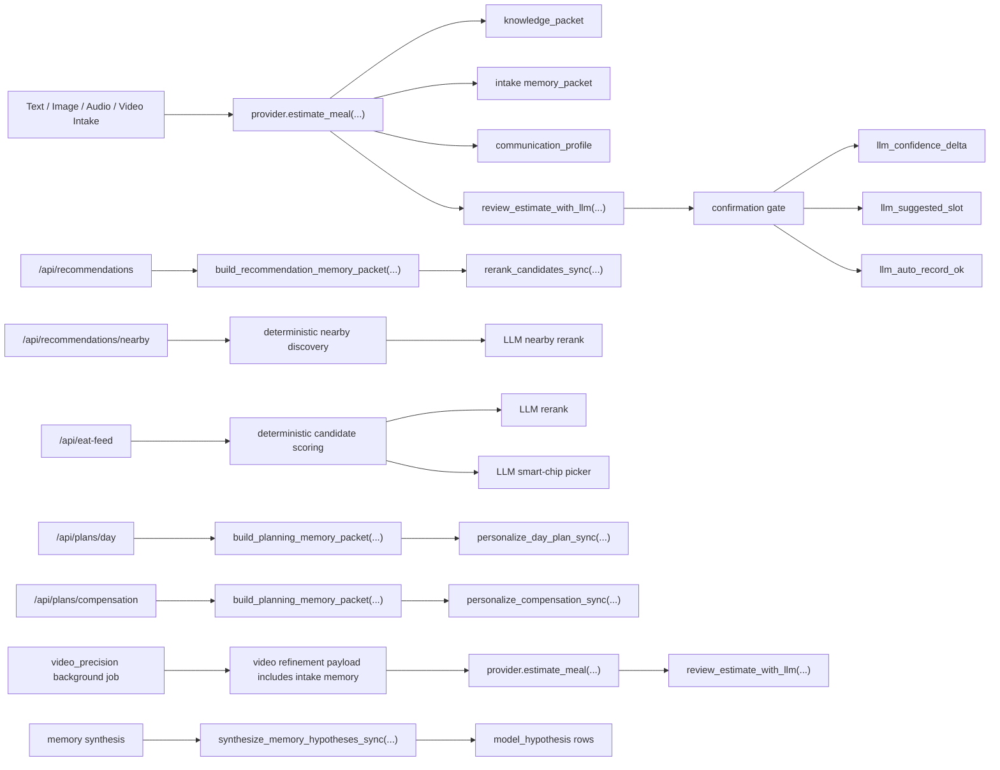

# LLM Integration Coverage Report

Date: 2026-03-20

## Executive Summary

This pass connected the main personalization and decision surfaces that previously stopped at schema or packet level:

- Intake estimation now passes `knowledge_packet`, `memory_packet`, and `communication_profile` into the provider path.
- Intake confirmation now consumes LLM review signals for confidence adjustment, clarification targeting, and auto-record gating.
- Recommendation routes now use memory-aware LLM reranking instead of only deterministic ordering.
- Nearby shortlists now get a final LLM rerank layer on top of deterministic place discovery.
- Eat Feed now uses LLM for both shortlist reranking and smart-chip selection.
- Day planning and compensation planning now accept planning memory and communication profile for final personalization.
- Video refinement jobs now carry intake memory into the async provider path and run the same LLM review step.
- Memory synthesis now writes back `model_hypothesis` rows from bounded LLM hypothesis generation.

Important runtime note:

- Code wiring is complete.
- Remote LLM execution still depends on runtime config. The current `.env` must provide a valid `AI_BUILDER_TOKEN`, and `AI_PROVIDER` must be `builderspace` for remote calls to happen.
- Without that, every path still falls back safely to deterministic behavior.

## Integration Map

## Coverage Matrix

| Surface | Before | After | LLM Role | Deterministic Fallback | Verification |
| --- | --- | --- | --- | --- | --- |
| Intake estimation | `knowledge_packet` only | `knowledge_packet` + `memory_packet` + `communication_profile` | meal estimate review and personalization context | heuristic provider still works | `test_intake_route_passes_memory_packet_and_communication_profile` |
| Confirmation gate | deterministic only | consumes `llm_confidence_delta`, `llm_suggested_slot`, `llm_followup_question`, `llm_auto_record_ok` | confidence calibration and clarification targeting | original gates still run | `test_confirmation_uses_llm_review_signal` |
| Recommendations | deterministic ranking | route-level memory-aware rerank | reorder shortlist and refine reasons | original order preserved if no LLM output | `test_recommendations_route_uses_llm_rerank_and_memory_packet` |
| Nearby recommendations | deterministic shortlist only | deterministic shortlist + LLM rerank | reorder nearby shortlist and reason factors | original shortlist preserved | covered by route wiring and full test suite |
| Eat Feed ranking | deterministic only | deterministic score + LLM rerank | reorder top candidates, add hero reason | deterministic score remains baseline | `test_eat_feed_route_and_chip_picker_use_llm` |
| Eat Feed smart chips | raw provider private call | provider-agnostic `complete_structured` path | choose most useful 3 chips | top-3 deterministic fallback | `test_eat_feed_route_and_chip_picker_use_llm` |
| Day plan | deterministic split only | planning packet + communication profile + LLM personalization | adjust allocations and coach message | baseline split remains valid | `test_day_plan_route_uses_llm_personalization` |
| Compensation plan | deterministic options only | planning packet + communication profile + LLM personalization | recommend option, rewrite notes, coach message | baseline option list remains valid | `test_compensation_plan_route_uses_llm_personalization` |
| Video refinement job | async estimate without memory | async estimate + memory packet + communication profile + LLM review | richer video refinement judgment | fallback estimate still runs | `test_video_refinement_payload_includes_memory_packet`, `test_video_refinement_wires_memory_packet_into_provider` |
| Memory synthesis | deterministic hypotheses only | bounded LLM hypothesis generation writes `model_hypothesis` | generate cautious higher-level memory hypotheses | deterministic user-stated / inferred hypotheses remain | `test_memory_synthesis_adds_model_hypothesis` |

## Files Changed

- `backend/app/providers/base.py`
- `backend/app/providers/heuristic.py`
- `backend/app/providers/builderspace.py`
- `backend/app/services/llm_support.py`
- `backend/app/api/routes.py`
- `backend/app/services/confirmation.py`
- `backend/app/services/memory.py`
- `backend/app/services/recommendations.py`
- `backend/app/services/planning.py`
- `backend/app/services/eat_feed.py`
- `backend/app/services/video_intake.py`
- `backend/tests/test_llm_integration_wiring.py`

## What Was Intentionally Left Deterministic

These were not moved to LLM ownership in this pass:

- calorie arithmetic
- recovery overlay math
- weekly summary math
- body-goal calibration math
- Google Places retrieval itself
- hard safety fallbacks when remote LLM is unavailable

Reason:

- These are accounting, persistence, and external-fetch layers where determinism is still the reliable source of truth.
- LLM is now attached as the personalization and bounded-choice layer around them, not the owner of irreversible math.

## Activation Checklist

To actually exercise the remote LLM path at runtime:

1. Set `AI_PROVIDER=builderspace`.
2. Set a valid `AI_BUILDER_TOKEN`.
3. Keep deterministic fallbacks enabled.
4. Verify requests through the updated routes and background jobs.

## Verification Result

Full backend suite was run after the wiring changes.

- Command: `python -m pytest backend/tests -q --basetemp <fresh-temp-dir>`
- Result: `82 passed`
- Warning: one non-fatal `PytestCacheWarning` on Windows cache path creation
