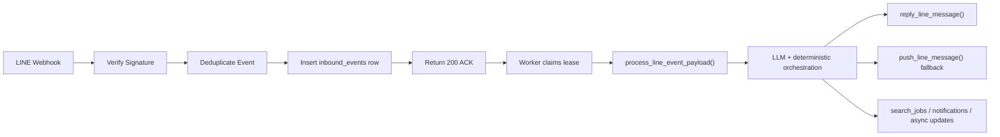
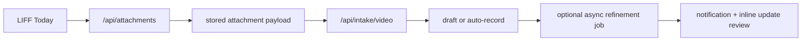
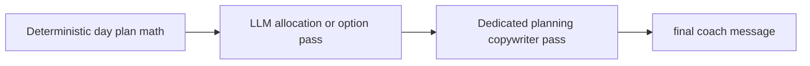

# Production-Grade LLM Rollout Report

Date: 2026-03-21

## Overall Status

| Area | Status | Notes |
| --- | --- | --- |
| Same-origin web deployment | Done | `VITE_API_BASE_URL=''`, backend serves `frontend/dist`. |
| Role-based runtime split | Done | `APP_RUNTIME_ROLE=web/worker`, dedicated worker entrypoint, Docker role switch. |
| Production config fail-fast | Done | `production_config_errors()` enforces required production env. |
| CORS allowlist | Done | Production no longer falls back to wildcard CORS. |
| Dev auth fallback blocked in production | Done | `X-Line-User-Id` and dev default auth are blocked in production. |
| Health/readiness endpoints | Done | `/healthz` and `/readyz` added and wired. |
| Webhook ack-fast queue ingest | Done | `/webhooks/line` now verifies, dedupes, enqueues, and returns immediately. |
| Inbound event dedupe | Done | `inbound_events` queue table + unique external event id. |
| Worker lease/reclaim model | Done | `inbound_events` and `search_jobs` both support lease reclaim. |
| LINE reply fallback to push | Done | Worker uses reply-first, push-second behavior. |
| Today video upload flow | Done | LIFF Today now uploads video, creates `/api/intake/video`, and refreshes local state. |
| Frontend quality gate | Done | `npm run lint`, `npm run build`, `npm test` all pass. |
| Frontend test harness | Done | `Vitest + RTL + MSW` added. |
| LLM routing expansion | Partial | Hybrid intent routing and memory relevance selector are wired into webhook/intake/recommendation/planning. |
| Recommendation policy expansion | Partial | Deterministic candidate generation is preserved; LLM policy now adds `coach_message`, `hero_reason`, `strategy_label`. |
| Planning wording via dedicated LLM layer | Done | Planning now separates LLM allocation/selection from a dedicated final copywriter pass. |
| Observability on webhook worker path | Done | Queue ingress + worker task runs now flow into dashboard slices and eval export. |
| Eval export for Phase B | Done | `/api/observability/eval-export` exposes webhook worker and planning-copy slices. |
| Agentic enforcement | Done | `.\scripts\run_agentic_checks.ps1 -IncludeFrontend` now passes locally. |
| Full backend suite verification | Done | Full `backend/tests` run completes locally: `91 passed`. |
| Dual deploy architecture | Deferred | Same-origin remains the active production model; Phase C analysis is documented separately. |

## Architecture Changes

## Files Changed

### Backend runtime and deployment

- `backend/app/config.py`
- `backend/app/main.py`
- `backend/app/worker.py`
- `Dockerfile`
- `.env.example`

### Queue, worker, and runtime schema

- `backend/app/models.py`
- `backend/app/schema_sync.py`
- `backend/app/services/background_jobs.py`
- `backend/app/services/inbound_events.py`
- `backend/app/services/line.py`

### LLM-aware routing, planning, and recommendations

- `backend/app/api/routes.py`
- `backend/app/services/llm_support.py`
- `backend/app/services/planning.py`
- `backend/app/services/recommendations.py`
- `backend/app/schemas.py`

### Observability dashboard and eval export

- `backend/app/api/observability_routes.py`
- `backend/app/services/observability.py`
- `backend/app/services/observability_console.py`
- `frontend/src/admin/adminTypes.ts`
- `frontend/src/admin/components/EvalPanel.tsx`
- `frontend/src/admin/components/TraceListPanel.tsx`
- `frontend/src/admin/components/UsagePanel.tsx`
- `frontend/src/admin/pages/ObservabilityDashboardPage.tsx`

### Frontend production gate and LIFF video intake

- `frontend/package.json`
- `frontend/vite.config.ts`
- `frontend/src/api.ts`
- `frontend/src/AppContext.tsx`
- `frontend/src/pages/TodayPage.tsx`
- `frontend/src/pages/ProgressPage.tsx`

### Tests added or rewritten

- `backend/tests/conftest.py`
- `backend/tests/test_llm_integration_wiring.py`
- `backend/tests/test_observability_console.py`
- `backend/tests/test_runtime_controls.py`
- `backend/tests/test_summary_and_recommendations.py`
- `backend/tests/test_video_intake.py`
- `backend/tests/fixtures/meal-video.mp4`
- `scripts/run_agentic_checks.ps1`

## What Changed In Practice

### 1. Webhook is no longer synchronous business logic

- `/webhooks/line` now performs `verify -> trace -> dedupe -> enqueue -> ACK`.
- Business logic moved to `process_line_event_payload()` and is executed by the worker.

### 2. Worker is now claim/lease based

- `search_jobs` now has `claimed_at`, `lease_expires_at`, `claim_token`, `started_at`, `finished_at`.
- `inbound_events` mirrors the same lease model for LINE ingress events.
- Expired leases are reclaimable, which is the minimum viable production-safe pattern for multi-instance workers without Redis.

### 3. Production settings are enforceable

- Production now fails fast when critical env is missing:
  - `AI_PROVIDER=builderspace`
  - `AI_BUILDER_TOKEN`
  - `SUPABASE_URL`
  - `SUPABASE_SERVICE_ROLE_KEY`
  - `LINE_CHANNEL_SECRET`
  - `LINE_CHANNEL_ACCESS_TOKEN`
  - `LIFF_CHANNEL_ID`
  - `APP_BASE_URL`
  - `CORS_ALLOWED_ORIGINS`

### 4. LIFF is no longer missing video intake

- Today page now supports uploading a local video file.
- Upload flow:
  - upload binary to `/api/attachments`
  - submit returned attachment payload to `/api/intake/video`
  - refresh summary/logbook/activity/progress/eat surfaces

### 5. LLM usage expanded without surrendering deterministic control

- Hybrid webhook router now uses:
  - deterministic fast path for obvious tasks
  - LLM intent classification for ambiguous text
- Intake/recommendation/planning memory packets now pass through LLM relevance selection before downstream use.
- Recommendation responses now include LLM policy outputs:
  - `coach_message`
  - `hero_reason`
  - `strategy_label`

### 6. Planning now has a dedicated copywriter layer

- Day plan flow:
  - deterministic meal allocation remains the source of truth
  - optional LLM allocation pass can adjust within bounded structure
  - a separate LLM copywriter pass writes the final coaching message
- Compensation plan flow:
  - deterministic options remain the source of truth
  - optional LLM option selection stays bounded to those options
  - a separate LLM copywriter pass writes the final coaching message

### 7. Webhook observability now reaches Phase B depth

- Webhook ingress creates its own task run with:
  - `execution_phase=webhook_ingress`
  - `ingress_mode=ack_fast`
- Webhook worker processing creates task runs with:
  - `execution_phase=webhook_worker`
  - `ingress_mode=ack_fast`
  - provider/model descriptors when present
- Planning and recommendation runs now expose:
  - packet coverage flags
  - planning copy attempt state
  - planning copy layer
- Admin observability now exposes:
  - `execution_phase_breakdown`
  - `ingress_mode_breakdown`
  - `planning_copy_breakdown`
  - `fallback_reason_breakdown`
  - `deterministic_integration_error_codes`
  - packet coverage summary
- `/api/observability/eval-export` now returns webhook-worker and planning slices directly.

### 8. Agentic enforcement is stable on Windows

- Video tests no longer depend on on-the-fly ffmpeg generation.
- The repo carries a fixed sample MP4 fixture for marker-suite stability.
- Attachment upload tests now accept both successful probe metadata and explicit degraded probe fallback.
- `.\scripts\run_agentic_checks.ps1 -Fast` is available for high-signal iteration runs; default marker-suite enforcement remains the release gate.

## Verification Performed

### Impacted backend suites

- `backend/tests/test_llm_integration_wiring.py`
- `backend/tests/test_observability_console.py`
- `backend/tests/test_observability_admin.py`
- `backend/tests/test_runtime_controls.py`

Result:

- `29 passed`

### Full backend suite

- `python -m pytest backend/tests -q --basetemp backend\.pytest_tmp_full_phaseb2`

Result:

- `91 passed`

### Agentic gate

- `.\scripts\run_agentic_checks.ps1 -IncludeFrontend`

Result:

- runtime snapshot: remote LLM `ready`
- pytest marker suite: `47 passed, 44 deselected`
- frontend build/lint/test: all passing
- `tesseract`: optional / missing

### Frontend quality gate

- `npm run lint`
- `npm run build`
- `npm test`

Result:

- all passing

## Remaining Work

### Still incomplete from the original plan

- Recommendation policy is still only partially LLM-led.
  - candidate generation, hard filters, and most ranking constraints remain deterministic by design
- Phase C dual-deploy auth/session strategy is intentionally not implemented yet.
- Secret rotation and platform secret-manager cutover remain operator tasks before public launch.

### Recommended next steps

1. Expand recommendation policy prompts for exploration/diversity/comfort-vs-protein tradeoffs.
2. Add eval sets for routing, recommendation usefulness, nearby rerank, and video grounding.
3. Finish operational cutover:
   - rotate BuilderSpace and Google Maps keys
   - confirm secret manager source of truth
   - confirm public base URL / LINE webhook / LIFF URL
4. Revisit Phase C only if the triggers in `docs/phase-c-dual-deploy-analysis-2026-03-21.md` become real constraints.
