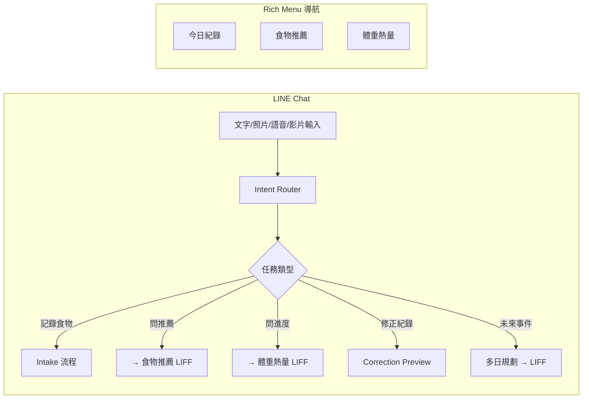
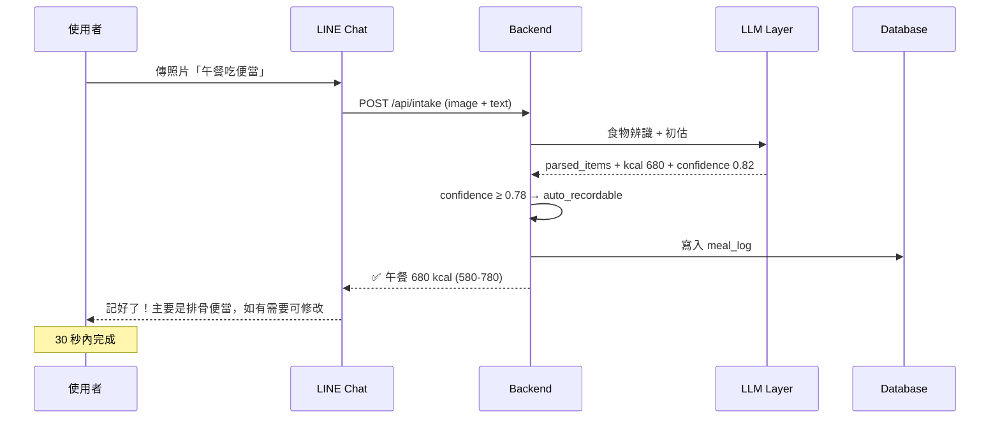
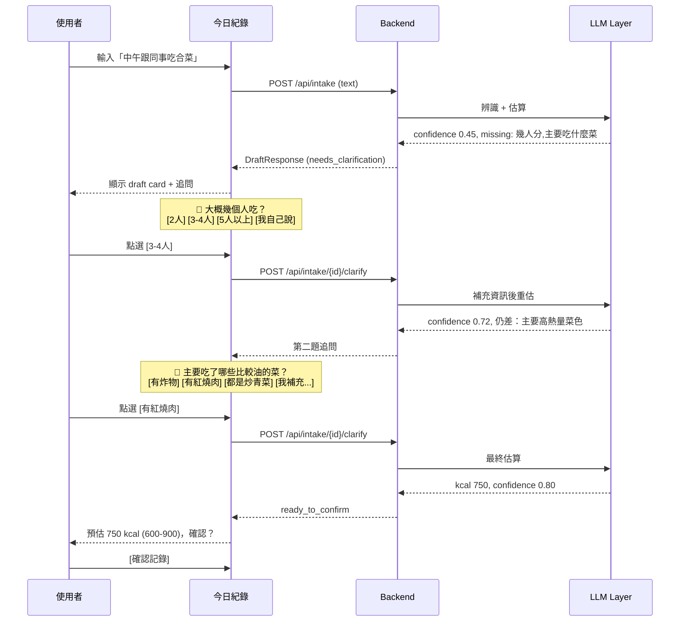
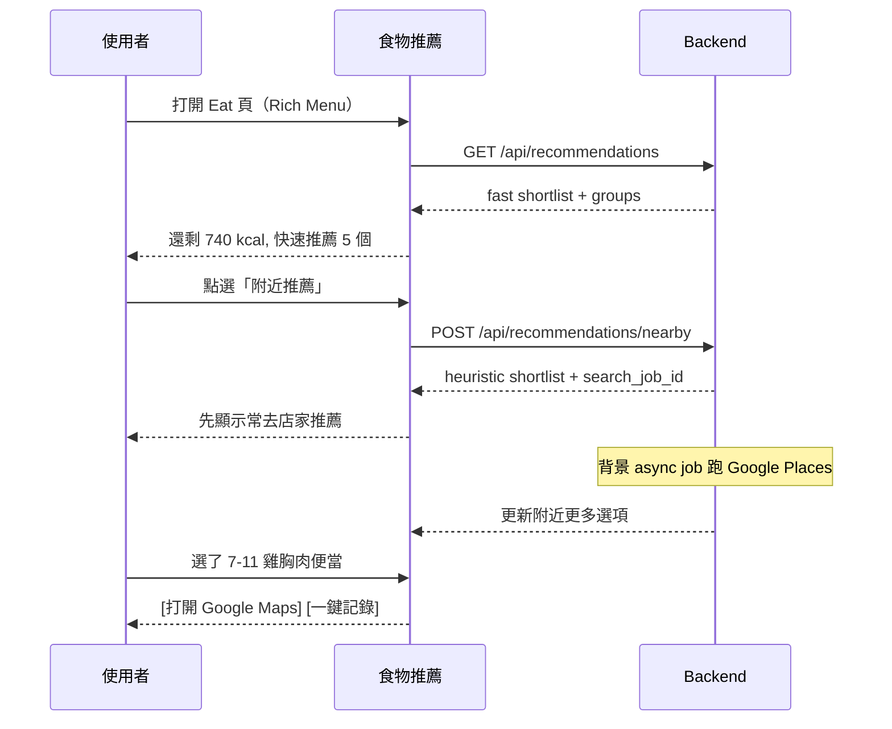
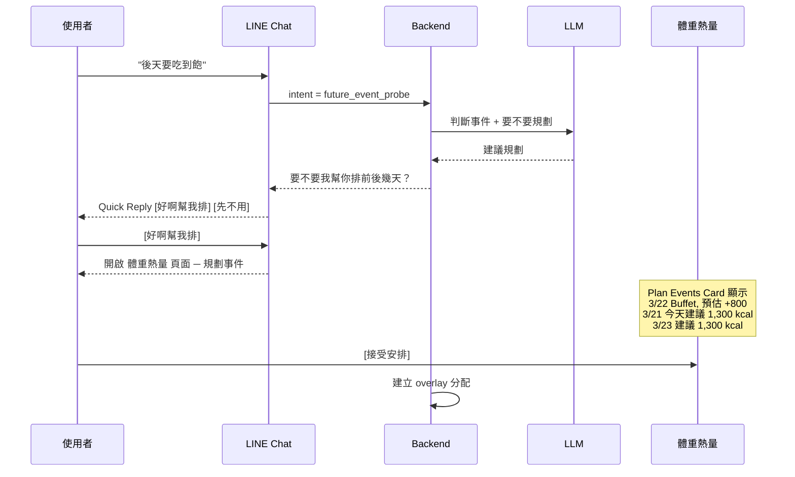
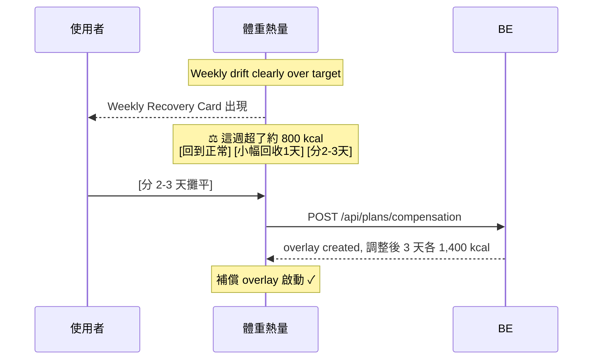

# AI 減脂操作系統 — 三頁 LIFF 功能與交互設計報告

> 基於 Codex 產出的全部規格文件整合分析，覆蓋三頁 LIFF 的確切功能、使用者交互流程、以及與 LLM 的配合設計。

---

## 目錄

1. [系統全局設計原則](#系統全局設計原則)
2. [跨頁面導航與 Surface 分工](#跨頁面導航與-surface-分工)
3. [Page 1：今日紀錄（Today）](#page-1今日紀錄today)
4. [Page 2：食物推薦（Eat）](#page-2食物推薦eat)
5. [Page 3：體重熱量（Progress）](#page-3體重熱量progress)
6. [Onboarding 冷啟動流程](#onboarding-冷啟動流程)
7. [LLM 與確定性系統分工總覽](#llm-與確定性系統分工總覽)
8. [端到端關鍵使用者旅程](#端到端關鍵使用者旅程)

---

## 系統全局設計原則

| 原則 | 意義 |
|------|------|
| **LINE chat = 捕獲現實** | 最快記錄食物、回答追問、一句話修正 |
| **今日紀錄 = 當日操控面板** | 今天吃了什麼、還剩多少、接下來該做什麼 |
| **食物推薦 = 決策工具** | 下一餐能吃什麼、去哪買 |
| **體重熱量 = 週控面板** | 這週方向對不對、要不要微調 |

> [!IMPORTANT]
> 每個使用者任務只有一個「家」。不會讓使用者困惑「這件事該在哪裡做」。同一個主動行為不應出現在多個 surface 上。

---

## 跨頁面導航與 Surface 分工



### 導航規則

| 從 → 到 | 觸發條件 |
|----------|----------|
| Chat → 食物推薦 | 推薦需要地點選擇或瀏覽多選項時 |
| Chat → 體重熱量 | 規劃需要多步驟時（聚餐預支、多日補償） |
| Chat → 今日紀錄 | Async update 需要更多上下文時 |
| 任何頁面 → Chat | 使用者想繼續對話式修正、分享地點 |

### Rich Menu（固定入口）

三個固定按鈕：`今日紀錄` / `食物推薦` / `體重熱量`，提供方向感。
Quick Reply 提供暫時性的情境選項（追問回答 chips、地點分支、補償方案選擇）。

---

## Page 1：今日紀錄（Today）

> **核心問題：我今天吃了什麼？還剩多少？接下來該做什麼？**

這是最高優先級頁面，是日常執行的操控面板。

### 頁面結構（由上到下）

#### A. 今日狀態條 `StatusStrip`

```
┌─────────────────────────────────────┐
│  已攝取 860 kcal  │  剩餘 740 kcal  │
│  目標 1,600 kcal  │  本週 略超 ▲     │
│                   │  [補償中] badge  │
└─────────────────────────────────────┘
```

- **永遠可見**在頁面頂部
- 顯示：consumed kcal / remaining kcal / target kcal
- 顯示：weekly drift micro-summary（`正常` / `略超 ▲` / `明顯超標 ▲▲`）
- 如有 overlay 補償中，顯示 `補償中` badge

**LLM 參與度：無。** 全部由確定性系統計算。

---

#### B. 活動草稿卡 `ActiveDraftCard`

**有草稿時（最高優先級卡片）：**

```
┌─────────────────────────────────────┐
│ 🍜 午餐草稿                    標準模式│
│                                     │
│ 牛肉麵 + 小菜                       │
│ 預估 680 kcal (580–780)             │
│ 信心：中等                          │
│ ⚠ 不確定因素：湯有沒有喝完           │
│                                     │
│ 💬 湯大概喝了多少？                  │
│ [幾口而已] [大概一半] [幾乎喝完]     │
│ [我自己補一句...]                    │
│                                     │
│ [確認記錄]  [直接記（用粗估）]       │
└─────────────────────────────────────┘
```

- 顯示：estimated kcal + range + 主要不確定因素
- 顯示：confirmation mode（auto_recordable / needs_clarification / needs_confirmation）
- 如需追問：顯示一題追問 + answer chips（Quick Reply 風格）
- answer chips 來自 `answer_options` response field
- 使用者可選 chip 或自由輸入文字
- 操作按鈕：`確認記錄` / `直接記（用粗估）`

**沒有草稿時，替換為低摩擦輸入卡：**

```
┌─────────────────────────────────────┐
│ 📝 記錄一餐                         │
│                                     │
│ [輸入文字...]          [📷] [🎤] [🎬]│
│                                     │
│ 快速加入：                           │
│ [🥚 慣性早餐] [⭐ 黃金午餐] [+]      │
└─────────────────────────────────────┘
```

- 文字輸入框 + 照片/語音/影片上傳按鈕
- 底下顯示最近常用的 anchor suggestions（黃金選項）

**LLM 參與度：高。**
- 食物解析（文字/語音/照片/影片 → structured items）
- 初估熱量、信心判斷
- 判斷是否需要追問、生成追問內容
- 追問使用「生活語言」（不問克數，問「吃幾成」「幾人分」）

**與 LLM 配合的確定性邏輯：**
- Draft 狀態機由後端管理（draft → awaiting_clarification → ready_to_confirm → confirmed）
- Clarification budget 由確定性邏輯控制（快速 0-1 題 / 標準 1-2 題 / 精細最多 4 題）
- `estimation_confidence ≥ 0.78` 且無 high-impact missing slots → auto_recordable，無需確認
- Confirmation calibration 根據過去 7 天的 reporting bias、correction rate、log completeness 動態調整

---

#### C. 待處理更新卡 `PendingAsyncUpdatesCard`

```
┌─────────────────────────────────────┐
│ 📦 1 筆更新建議                      │
│                                     │
│ 午餐牛肉麵                          │
│ 原始 680 kcal → 建議 720 kcal       │
│ 原因：比對品牌菜單後微調              │
│                                     │
│ [套用更新]        [維持原本]          │
└─────────────────────────────────────┘
```

- 只在有 pending suggested_updates 時顯示，位置靠近頂部
- 顯示：原始 kcal vs 建議 kcal + 原因 + 資料來源
- 操作：`Apply` / `Dismiss`
- **絕不靜默覆寫**已確認紀錄

**LLM 參與度：中。** 背景 async research 由 LLM 驅動的 precision pass 產出，但 Apply/Dismiss 決策在使用者手上。

---

#### D. 用餐時間軸 `MealTimeline`

```
┌─────────────────────────────────────┐
│ 🌅 早餐                             │
│   全麥吐司 + 黑咖啡         280 kcal│
│   ✓ 已確認              [修改]      │
│                                     │
│ 🌞 午餐                             │
│   牛肉麵 + 小菜             680 kcal│
│   ⚠ 信心中等，粗估     [修改]       │
│                                     │
│ 🌙 晚餐                             │
│   （尚未記錄）                       │
└─────────────────────────────────────┘
```

- 今日所有已記錄餐點，按時間排列
- 每筆顯示：餐別 / 簡短描述 / kcal / 不確定 badge / 修改入口
- 已套用 async update 的標記
- 修改動作進入 correction flow

**LLM 參與度：無。** 純呈現確定性資料。

---

#### E. 下一步建議卡 `NextStepCard`

```
┌─────────────────────────────────────┐
│ 💡 建議下一步                        │
│                                     │
│ 還剩 740 kcal，晚餐可以考慮：        │
│ → 看看適合的晚餐選項                 │
│                                     │
│ [打開食物推薦]                       │
└─────────────────────────────────────┘
```

- 一次只顯示一個主要建議動作
- 可能的建議：
  - 完成未解決的草稿
  - 瀏覽附近晚餐選項（連結到食物推薦頁）
  - 接受或dismiss pending update
  - overlay 補償中的今日調整提示

**LLM 參與度：低。** 確定性邏輯決定顯示什麼建議，LLM 可能產出建議的文案措辭。

---

#### F. 補償覆蓋卡 `RecoveryOverlayCard`

```
┌─────────────────────────────────────┐
│ ⚡ 補償中                            │
│                                     │
│ 本次補償到 3/22（還有 2 天）          │
│ 今日調整預算：1,400 kcal             │
│ 原因：昨天聚餐超標 +500              │
│                                     │
│ [停止補償]                           │
└─────────────────────────────────────┘
```

- 只在 overlay 啟動時可見
- 顯示：active until / 今日 adjusted budget / 原因
- 操作：停止 overlay

**LLM 參與度：低。** 確定性計算 overlay 分配，LLM 在之前的討論階段產出方案。

---

### Today 頁面不該顯示的

- ❌ 大量推薦瀏覽
- ❌ 長期趨勢圖表
- ❌ 附近店家搜尋

---

## Page 2：食物推薦（Eat）

> **核心問題：我現在可以吃什麼？去哪裡買？**

這是即時決策頁，幫你做出下一餐的選擇。

### 頁面結構（由上到下）

#### A. 情境選擇器 `ContextChooser`

```
┌─────────────────────────────────────┐
│ 🕐 現在/等等    📍 目前位置 ▼        │
│ 🍽 晚餐 ▼                           │
│ 風格偏好：                           │
│ [最穩] [最方便] [想吃爽] [高蛋白]     │
└─────────────────────────────────────┘
```

- **時間**：現在 / 等等
- **地點**：目前位置 / 目的地 / 已儲存地點 / 手動輸入
- **餐別**：早餐 / 午餐 / 晚餐 / 宵夜
- **風格偏好**（可選）：最穩 / 最方便 / 想吃爽一點 / 高蛋白優先

這個控制器取代隱藏假設，讓使用者明確設定情境。

**LLM 參與度：無。** 純 UI 控制器。

---

#### B. 快速推薦列 `FastRecommendationRail`

```
┌─────────────────────────────────────┐
│ ⭐ 現在可以吃這些                     │
│                                     │
│ ┌────┐ ┌────┐ ┌────┐ ┌────┐        │
│ │⭐御│ │🟢超│ │🟡外│ │🟢便│        │
│ │飯糰│ │商雞│ │帶沙│ │利商│        │
│ │280 │ │胸肉│ │拉  │ │店地│        │
│ │kcal│ │350 │ │400 │ │瓜便│        │
│ │    │ │kcal│ │kcal│ │當  │        │
│ └────┘ └────┘ └────┘ └────┘        │
│                                     │
│ 剩餘 740 kcal · 晚餐                │
└─────────────────────────────────────┘
```

- 基於 remaining kcal + meal type + hard dislikes + golden orders + 附近 context
- 前 3-5 個最可行的選項
- 不做複雜排序，先做 eligibility filtering

**LLM 參與度：中。**
- 確定性系統做硬篩（熱量限制 / 餐別 / 排斥食物 / 可得性）
- LLM 提供推薦理由（`reason_factors`），用溫和可讀的方式解釋

---

#### C. 附近搜尋模組 `NearbyModule`

```
┌─────────────────────────────────────┐
│ 📍 附近推薦                          │
│                                     │
│ 搜尋範圍：                           │
│ [目前位置] [目的地] [住家] [公司]     │
│ [手動輸入地點...]                    │
│                                     │
│ 🔄 搜尋中...                        │
│                                     │
│ 結果：                               │
│ ┌───────────────────────────────┐   │
│ │ 🏪 7-ELEVEN 信義門市          │   │
│ │ 步行 3 分鐘 · 營業中          │   │
│ │ 推薦：地瓜雞胸便當 380 kcal   │   │
│ │ 理由：高蛋白優先、你常買       │   │
│ │ [打開 Google Maps]            │   │
│ └───────────────────────────────┘   │
└─────────────────────────────────────┘
```

- 支援：current area / destination / home / office / manual place
- 先顯示 heuristic shortlist（本地記憶中的已知店家）
- 背景 async job 用 Google Places 搜尋更多，結果出來後更新
- 每筆顯示：距離 / 營業狀態 / kcal 範圍 / reason_factors / 外部連結

**LLM 參與度：高。**
- Async research job（`nearby_places`）由 LLM 協助分析搜尋結果
- LLM 產出推薦理由
- 確定性系統管理 job 排程和 cache

**Location Context 解析優先級：**
1. 使用者在當前請求中明確說的地點
2. LIFF geolocation
3. LINE location message
4. Saved place
5. Inferred default

---

#### D. 常去店家與黃金點餐 `FavoriteStoresCard`

```
┌─────────────────────────────────────┐
│ ⭐ 你的常用                          │
│                                     │
│ 🏪 全家信義店                        │
│    慣用：雞胸肉沙拉 + 無糖綠茶       │
│    380 kcal · 上次：3 天前            │
│    [一鍵記錄]  [Google Maps]         │
│                                     │
│ 🍜 金峰滷肉飯                        │
│    慣用：滷肉飯小碗 + 湯青菜          │
│    520 kcal · 上次：1 週前            │
│    [一鍵記錄]  [Google Maps]         │
└─────────────────────────────────────┘
```

- **第一級區塊**，不是藏在設定裡
- 顯示：favorite stores / stable store-order pairs / recently successful orders
- 來自 L2 記憶層 `memory_signals` 中的 `food_repeat` 和 `store_order_signals`
- 操作：一鍵記錄（直接走 intake auto-record） / 打開外部連結

**LLM 參與度：低。** 確定性系統從 L2 記憶中取出常用組合。LLM 在最初記錄食物時參與過理解。

---

#### E. 情境分組推薦 `RecommendationGroups`

```
┌─────────────────────────────────────┐
│ 分組推薦（次於快速推薦列）            │
│                                     │
│ 🟢 最穩                              │
│ · 全家雞胸肉便當 380 kcal           │
│ · 自帶沙拉 350 kcal                 │
│                                     │
│ ⚡ 最方便                            │
│ · 7-11 御飯糰 x2  280 kcal          │
│ · 三明治組合 320 kcal               │
│                                     │
│ 🔥 想吃爽一點                        │
│ · 半份牛肉麵 480 kcal               │
│ · 迷你 pizza 1 片 380 kcal          │
│                                     │
│ 💪 高蛋白優先                        │
│ · 超商雞胸肉 + 茶葉蛋 350 kcal      │
│                                     │
│ 🍷 聚餐前適合                        │
│ · 輕量沙拉早餐 280 kcal             │
│                                     │
│ 🔄 爆卡後適合                        │
│ · 清淡湯麵 380 kcal                 │
└─────────────────────────────────────┘
```

- 六個情境分組：最穩 / 最方便 / 想吃爽一點 / 高蛋白優先 / 聚餐前適合 / 爆卡後適合
- 每項顯示：kcal range / reason factors / 是否為 favorite/golden/nearby/memory-based
- 次於 fast recommendation rail

**LLM 參與度：中。**
- 確定性系統做 eligibility filtering（熱量 / 餐別 / 排斥 / 可得性）
- LLM 提供 reason_factors 和分組歸類的語義理解

---

#### F. 規劃與補償預覽 `PlanningPreview`

```
┌─────────────────────────────────────┐
│ 📋 今日餐次規劃                      │
│                                     │
│ 早餐 350 kcal ✓ 已記 280            │
│ 午餐 600 kcal ✓ 已記 680            │
│ 晚餐 450 kcal ← 剩餘預算            │
│ 彈性 200 kcal                       │
│                                     │
│ [調整規劃]                           │
│                                     │
│ ── 補償選項（僅在需要時顯示）──       │
│ [不補償] [小幅回收 1 天] [分 2-3 天]  │
└─────────────────────────────────────┘
```

- 不佔滿整頁，但因為使用者常常同時做「選食物 + 調整計畫」
- 顯示今日 meal budget split
- 如有 overlay，顯示 overlay-aware planning state
- 補償選項在需要時顯示

**LLM 參與度：高。**
- LLM 參與預支/補償方案的討論和生成
- 多日規劃方案由 LLM 產出（今明後幾天怎麼吃）
- 確定性系統做數學：每日分配、熱量計算

---

### Eat 頁面不該顯示的

- ❌ 完整用餐時間軸
- ❌ 活動追問對話
- ❌ 14 天體重分析

---

## Page 3：體重熱量（Progress）

> **核心問題：我這週有沒有在正確軌道上？需不需要微調？**

這是週頻率的控制面板，不是每天都要看。

### 頁面結構（由上到下）

#### A. 週狀態英雄區 `WeeklyStatusHero`

```
┌─────────────────────────────────────┐
│ 📊 本週總覽                          │
│                                     │
│ 最新體重    63.2 kg                  │
│ 7 日平均    63.5 kg                  │
│ 14 日方向   ↘ 緩降中                 │
│                                     │
│ 本週目標    11,200 kcal              │
│ 本週已吃     8,640 kcal              │
│ 本週偏差    -560 kcal                │
│ 狀態       ✅ 正常軌道               │
└─────────────────────────────────────┘
```

- 狀態標籤：`正常軌道` / `略超` / `明顯超標` / `明顯低於`
- 不過度解讀單日波動，重點看趨勢

**LLM 參與度：無。** 全部確定性計算。

---

#### B. 趨勢卡 `TrendCard`

```
┌─────────────────────────────────────┐
│ 📈 趨勢                             │
│                                     │
│ [體重趨勢圖 - 14 天折線圖]           │
│  63.8 ─·─·─ 63.5 ─·── 63.2        │
│                                     │
│ [熱量達標趨勢 - 7 天長條圖]           │
│  ██ ██ ▓▓ ██ ██ ▓▓ ░░              │
│                                     │
│ 💬 最近兩週穩定下降中，繼續保持。     │
│    目前每日目標 1,600 kcal 看起來     │
│    蠻適合的，暫時不用調整。           │
└─────────────────────────────────────┘
```

- 體重趨勢圖（14 天）
- 最近熱量 adherence 趨勢圖（7 天）
- 如有 overlay effect，用不同顏色標示
- 底部附帶教練式建議文字

**LLM 參與度：中。**
- 確定性系統計算趨勢數據、7日平均、14日方向
- LLM 產出教練式建議語句（「目前表現穩定」「建議再觀察一週」）
- 建議類型由確定性邏輯決定：維持 / 小降 100 kcal / 小升 100 kcal / 暫不調整

---

#### C. 週補償決策卡 `WeeklyRecoveryCard`

```
┌─────────────────────────────────────┐
│ ⚖ 這週有點超標，要處理嗎？            │
│                                     │
│ 本週超了約 800 kcal                  │
│                                     │
│ [回到正常，不特別處理]                │
│ [小幅回收 1 天]                      │
│ [分 2-3 天攤平]                      │
└─────────────────────────────────────┘
```

- **只在需要時顯示**
- 不鼓勵激烈報復性節食
- 三個選項符合 `preferences.compensation_style`

**LLM 參與度：中。**
- 確定性系統判斷 `should_offer_weekly_recovery`
- LLM 產出各方案的具體配置（每天分配多少）
- 選項措辭需溫和

---

#### D. 計畫事件卡 `PlanEventsCard`

```
┌─────────────────────────────────────┐
│ 📅 即將到來                          │
│                                     │
│ 3/22 (六) 晚餐聚會                   │
│ 預估多吃 +500 kcal                  │
│ 前後幾天已安排 ✓                     │
│ [查看安排]                           │
│                                     │
│ 3/25 (二) 午餐 buffet                │
│ ⚠ 尚未規劃                          │
│ [幫我規劃前後幾天]                    │
└─────────────────────────────────────┘
```

- 顯示已知的 upcoming events（聚餐、buffet、旅行）
- 每個事件顯示：plan status / 前後天是否已安排 / CTA

**LLM 參與度：高。**
- LLM 協助預支/補償規劃
- 確定性系統儲存 plan_events 和 overlay

---

#### E. 記錄品質信號卡 `LoggingQualityCard`

```
┌─────────────────────────────────────┐
│ 📝 記錄品質                          │
│                                     │
│ 最近紀錄較完整，繼續保持 👍           │
│ 目前系統用標準確認模式                │
│                                     │
│ (或)                                │
│ 最近紀錄比較模糊，所以我可能會多問     │
│ 一題，讓估算更準確一點。              │
└─────────────────────────────────────┘
```

- **語氣溫和，不指責**
- 不直接說「你都少報」
- 顯示：最近修正頻率 / 紀錄完整度 / 系統目前是否用了更嚴格的確認模式
- 幫助解釋為什麼助理可能多問了幾題

**LLM 參與度：中。**
- 確定性系統計算 reporting_bias 分數
- LLM 產出溫和的描述文案
- Reporting bias 影響確認引擎但不直接顯示原始分數

---

### Progress 頁面不該顯示的

- ❌ 附近店家瀏覽
- ❌ 多步驟追問 UI
- ❌ 大量推薦目錄

---

## Onboarding 冷啟動流程

### 觸發條件

首次 LIFF 啟動、認證成功後。

### 設計

- **單一頁面**，5 題
- **可跳過**（`POST /api/onboarding/skip`）
- 答案立即影響推薦和規劃

### 問題設計

| # | 問題 | 儲存位置 | L2 Seed Signal |
|---|------|----------|----------------|
| 1 | 你通常吃早餐嗎？ | `preferences.breakfast_habit` | `breakfast_habit:<value>` |
| 2 | 你需要主食嗎？（飯、麵、麵包） | `preferences.carb_need` | `carb_need:<value>` |
| 3 | 晚餐偏好？ | `preferences.dinner_style` | `dinner_style:<value>` |
| 4 | 有沒有明確不吃的？ | `preferences.hard_dislikes` | per dislike signal |
| 5 | 爆卡後你比較想怎麼處理？ | `preferences.compensation_style` | `compensation_style:<value>` |

Q5 選項：
- 直接回到正常
- 輕微補一天
- 分幾天攤平
- 讓系統決定

**LLM 參與度：無。** 結構化表單直接寫入 `preferences` + 種子 L2 signals，source = `user_stated`。

---

## LLM 與確定性系統分工總覽

### LLM 負責（需要語義理解的任務）

| 任務 | 觸發 surface | 說明 |
|------|-------------|------|
| 食物理解 | Chat / Today intake | 文字/照片/語音/影片 → 食物名稱 + 份量線索 |
| 初估熱量 | Chat / Today intake | 基於辨識結果產出 kcal estimate + range + confidence |
| 判斷追問 | Chat / Today intake | 決定要不要問、問什麼 |
| 生成追問 | Chat / Today draft | 用生活語言提問（不問克數） |
| 推薦理由 | Eat recommendations | 產出 reason_factors |
| 預支/補償討論 | Eat planning / Progress | 產出多日方案文字 |
| 偏好自然語言更新 | Chat correction | 「我其實開始吃早餐了」→ 更新 preferences |
| 趨勢建議文案 | Progress trend | 教練式語句（維持/微調建議） |
| L2→L3 synthesis | Backend periodic | 從行為模式歸納假設 |
| 語義正規化 | Backend knowledge | 食物 alias 合併、canonicalization |

### 確定性系統負責（不應依賴 LLM 的任務）

| 任務 | 說明 |
|------|------|
| 今日總熱量 / 剩餘熱量 | 純數學 |
| 體重趨勢（7d avg, 14d direction） | 純數學 |
| 熱量目標計算與校正邏輯 | rule-based |
| Draft 狀態機管理 | state machine transitions |
| Clarification budget 控制 | 每種模式的追問上限 |
| Confirmation calibration | 根據 reporting_bias + correction_rate 調整閾值 |
| 推薦候選篩選（eligibility filtering） | 熱量/餐別/可得性/排斥 |
| Foods / Preferences 存取 | CRUD |
| Reporting bias profile 更新 | 確定性計分 |
| Weekly overlay 分配計算 | arithmetic |
| L2 signal 的 evidence_score / counter_evidence_score | 衰減公式 |

### Model Routing 策略

| 層級 | 模型 | 用途 |
|------|------|------|
| Layer 1 (Router / Light) | deepseek | intent routing / 小型分類 / 文字正規化 |
| Layer 2 (Main) | supermind-agent-v1 | 食物理解 / 追問措辭 / 推薦文案 |
| Layer 3 (Complex) | gpt-5 | 品牌 reconciliation / 複雜研究綜合 |

> [!WARNING]
> 高層模型失敗**絕不能阻塞**主要交互。降級到下一層或確定性 fallback。

---

## 端到端關鍵使用者旅程

### 旅程 1：日常記錄一餐（30 秒目標）



### 旅程 2：模糊食物追問



### 旅程 3：晚餐猶豫時看推薦



### 旅程 4：聚餐預支規劃



### 旅程 5：爆卡後補償



---

> [!TIP]
> **設計的核心哲學：** 讓使用者在大部分情況下 30 秒記完一餐，不知道吃什麼時打開推薦頁就有答案，聚餐前後不焦慮因為系統已經幫你安排。不是在追求精準，而是追求「夠用到能持續做執行的程度」。
